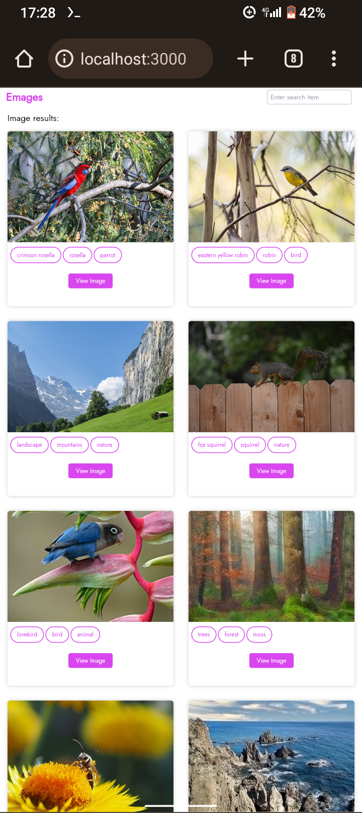

# Local Pixabay Image Site

This project allows you to create a local image site using the Pixabay API. You
can display and search for images from Pixabay.

## Project image


## Prerequisites

Before you begin, ensure you have met the following requirements:

-  Node.js and npm installed on your machine.
-  Pixabay API Key. You can get one by signing up at [Pixabay](https://pixabay.com/api/docs/).

## Setup

1. Clone this repository to your local machine:

```bash
   git clone https://github.com/Habib-0007/emages-image-site.git
```

2. Navigate to the project directory

```
   cd emages-image-site
```

3. Install project dependencies:

```
npm install
```

4. Create a .env file in the project root and add your Pixabay API key:

```
VITE_API_KEY=your_api_key
```

## Usage

-  Start the local server:

```
npm run dev
```

-  Open your web browser and go to http://localhost:3000 to access the Pixabay
   image site
-  Use the search bar to search for images. The site will fetch images from
   Pixabay using your API key.

## Acknowledgments

[Pixabay](https://pixabay.com/api/docs/) for providing the API
